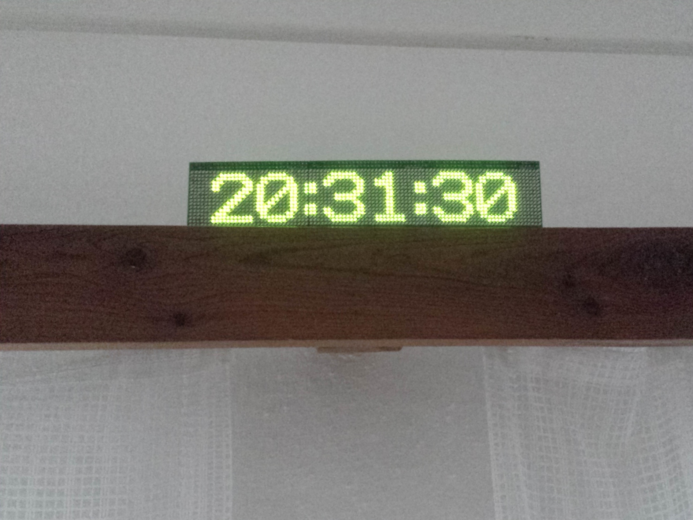

#Matrix digital clock

DIY clock with these features:
- LED matrix - 16 x 64 (1024 pixels) or version with 16 x 96 pixels
- DCF Receiver and time synchronization from the radio
- or ESP8826 Wifi module and time synchronization from a NTP server

Project page: https://hackaday.io/project/19949-led-matrix-clock

Version 1 photo
-----

There are actually two versions of this project
- version 1 has 3 LED modules and firmware is much more stupid - no menu; just automatic DCF synchronization every midnight  **whole LED driver must be disabled because it inteferes the DCF radio**. All files used in version 1 are in dedicated branch called version1.
- version 2 has only 2 LED modules and the firmware is much more enhanced - there is a basic button control and menu to setup wifi connection, time source, day lumination, night lumination......; files for version2 are currently in master branch, version2 firmware can be easilly adjusted to use 3 LED modules instead of 2. Hardware is nearly the same but smaller.

Hardware
-----

The hardware consist of these PCBs:
- 2 or 3 pcs LED matrices (each one 16 x 32 LEDs)
- controller board with STM32F100 MCU and shift registers

Firmware
----

Firmware is based on [ChibiOS](http://www.chibios.org) embedded operating system. I use CMake build system so I have fork of the ChibiOS in my repositories. You can use mine version of ChibiOS with this specific commit:

`ccb51e8f5e04b7aec1c0fe87b7e3d1dd5d634bb4` 

You will probably need to adjust path in [CMakeLists.txt](fw/CMakeLists.txt) to the right ChibiOS directory.

Or you can use original ChibiOS version 3 with its Makefile and use the configuration from my [CMakeLists.txt](fw/CMakeLists.txt) to adjust original ChibiOS Makefile.

Build
----

Development toolchain is GNU arm gcc (https://launchpadlibrarian.net/209776202/gcc-arm-none-eabi-4_9-2015q2-20150609-linux.tar.bz2) version 4.9 - it contains interesting newlib library which saves a lot of RAM and hardware floating point support and many other features.

You can flash the MCU via openocd or my [kstlink](https://github.com/kubanecxxx/kstlink) project which is simple gdb server to debug and flash STM microcontrollers (I feel openocd too heavy).
